<!-- .slide: data-background="assets/jonakoh-unsplash.jpg" class="dark no-logo" -->

# Statistical Models for Microbiome Data

## A story in formulas, GIFs, and memes...

Christian Diener 
D&RI of Hygiene, Microbiology and Environmental Medicine

MOLMED Microbiome Course 2026

  

<a href="https://creativecommons.org/licenses/by-sa/4.0/"><i class="fa-solid fa-camera-retro"></i>CC BY-SA 4.0</a>
<a href="https://dienerlab.com"><i class="fa-solid fa-house-signal"></i></i>dienerlab.com</a>
<a href="https://github.com/dienerlab"><i class="fa-brands fa-github"></i>dienerlab</a>
<a href="https://bsky.app/profile/cdiener.com"><i class="fa-brands fa-bluesky"></i></i>@cdiener.com</a>

---

# Disclaimers

Might be a bit cringe-y, but so is statistics.

---

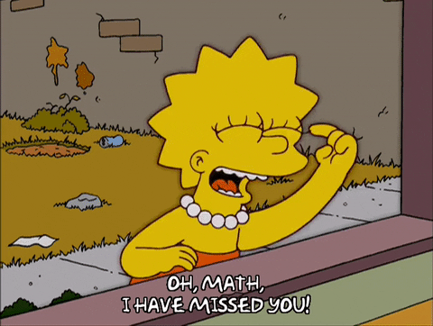

There will be math, but fairly little.

---

<!-- .slide: data-background="var(--primary)" class="dark" -->

# What will we look at..

Statistical models (distributions) used in microbiome research.

- main assumptions
- what is actually estimated from the data
- caveats

---

# The Jon Snow models

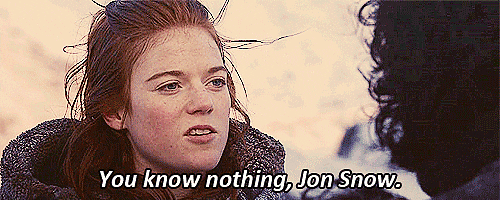

We know nothing about the data but want to do statistics anyway.

---

## Mann-Whitney U-test

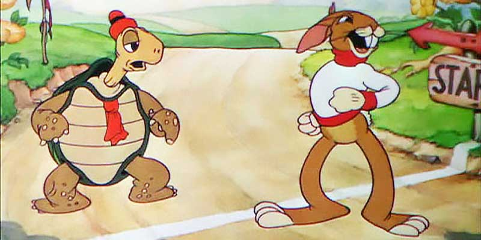 
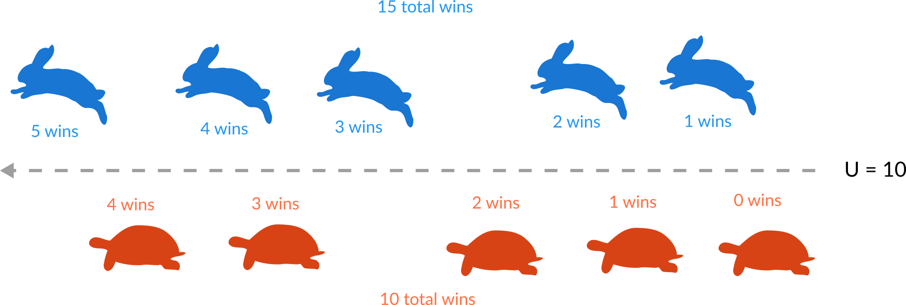

Non-parametric and great power, *but* the statistic of interest is weird and becomes
even weirder in regression.

---

## Maybe go parametric?

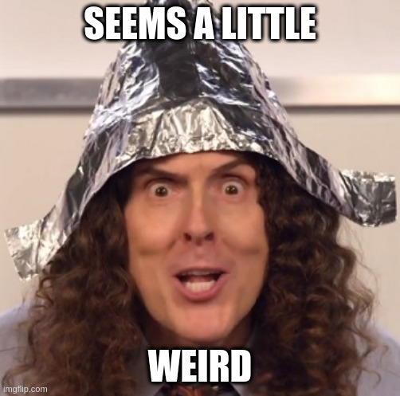

---

## Log-normal models

Abundances are continuous and positive, so if we log-transform it makes them normal, maybe?

$$
\begin{align*}
\log(a_i) &\approx \mathcal{N}(\mu, \sigma^2) \\\\
\mu &= \alpha + \boldsymbol{\beta}\mathbf{x}
\end{align*}
$$

For instance, for two comparison groups we would do:

$$ \mu = \alpha + \beta\cdot\mathbf{1}_{\{\text{group=2}\}}  $$

Intercept covers the reference groups, $\beta$ is the difference between groups.

---

## Transformations

The log-transform makes little difference to categorical models but *adds additional assumptions*
to regressions. Regression with those transformations is often called *generalized linear modeling*.

Abundance grows exponentially with the covariate. Is that biological?

In practice, any log-based transform works. This can be coupled with compositional analysis,
for instance by using a CLR-transform:

$$CLR(a_i) := \log(a_i) - \overline{\log(a_i)}$$

---

## Can we do better though?

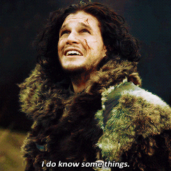

Generative models tend to perform better.

---

## Let's abstract sequencing...

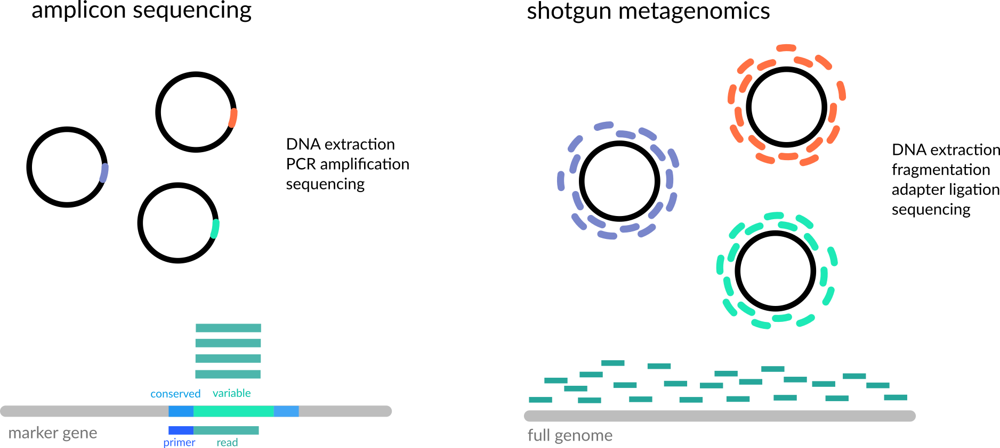

---

## Binomial regression

If we see sequencing as a random process trying to hit a particular DNA fragment(s) (or parts)
we get a binomial process.

$$
c_i \approx \mathcal{B}(n, p)
$$

$n$ is the number of reads.

We have $\mu = np$ and $\sigma^2 = np(1-p)$, so in general $\sigma^2 \leq \mu$.

In a regression we want to make $p$ dependent on our covariates, how do we do that?

---

## Transformations part deux

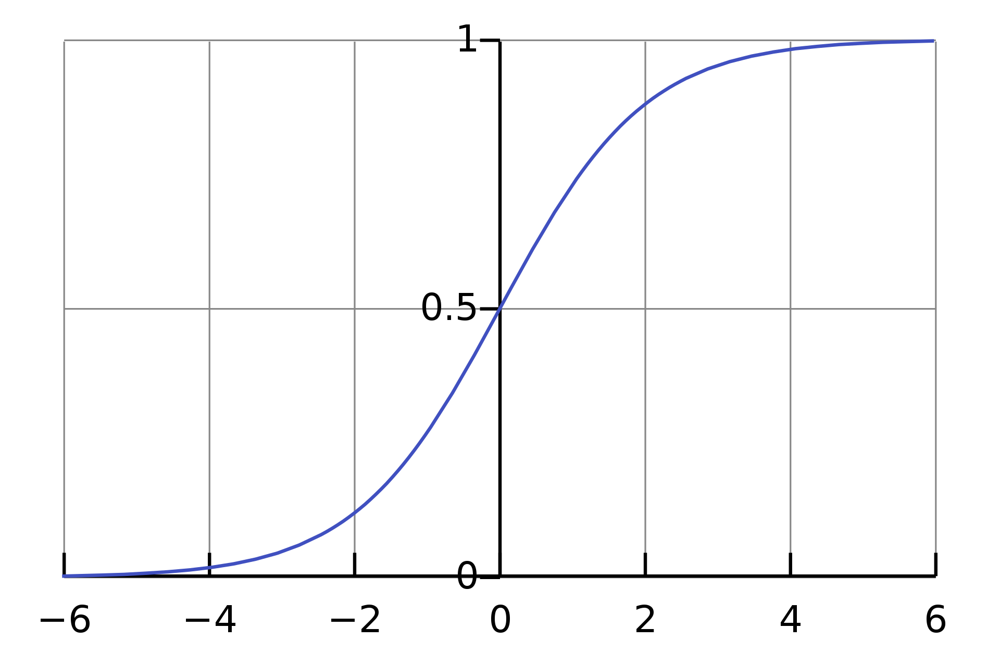

$$
\begin{align*}
c_i &\approx \mathcal{B}(n, p) \\\\
\log(\frac{p}{1-p}) &= \alpha + \boldsymbol{\beta}\mathbf{x}
\end{align*}
$$

---

## Poisson regression

In practice n is huge and p is tiny. So a Poisson process models this well.

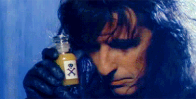

$$
\begin{align*}
c_i &\approx \mathcal{P}(\lambda) \\\\
\log(\lambda) &= \alpha + \boldsymbol{\beta}\mathbf{x}
\end{align*}
$$

So we get back our exponential/log scale.

We have $\mu = \lambda$ and $\sigma^2 = \lambda$, so in general $\sigma^2 = \mu$.

This *inflexibility of the variance* becomes a problem.

---

## Overdispersion

Frequentist statistics is not great with dispersion/variance in count data.

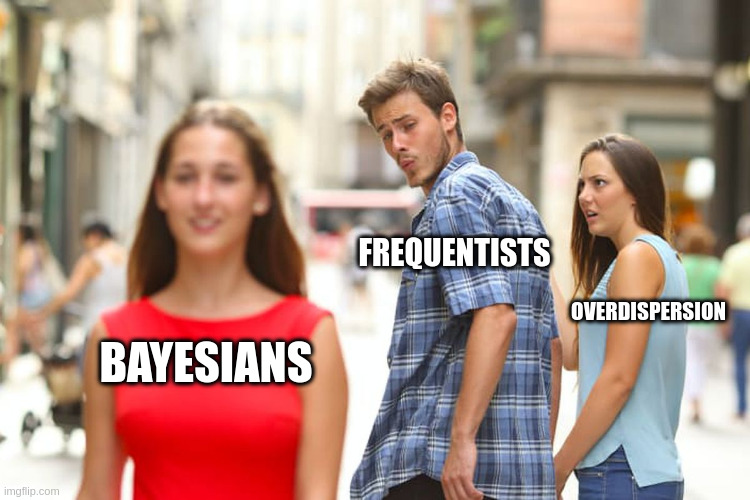

---

## Hierarchical models

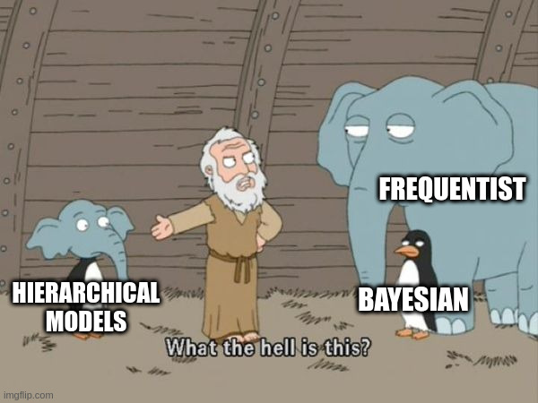

What if the parameter in the model comes from a distribution itself?

---

## Poisson-Gamma distribution

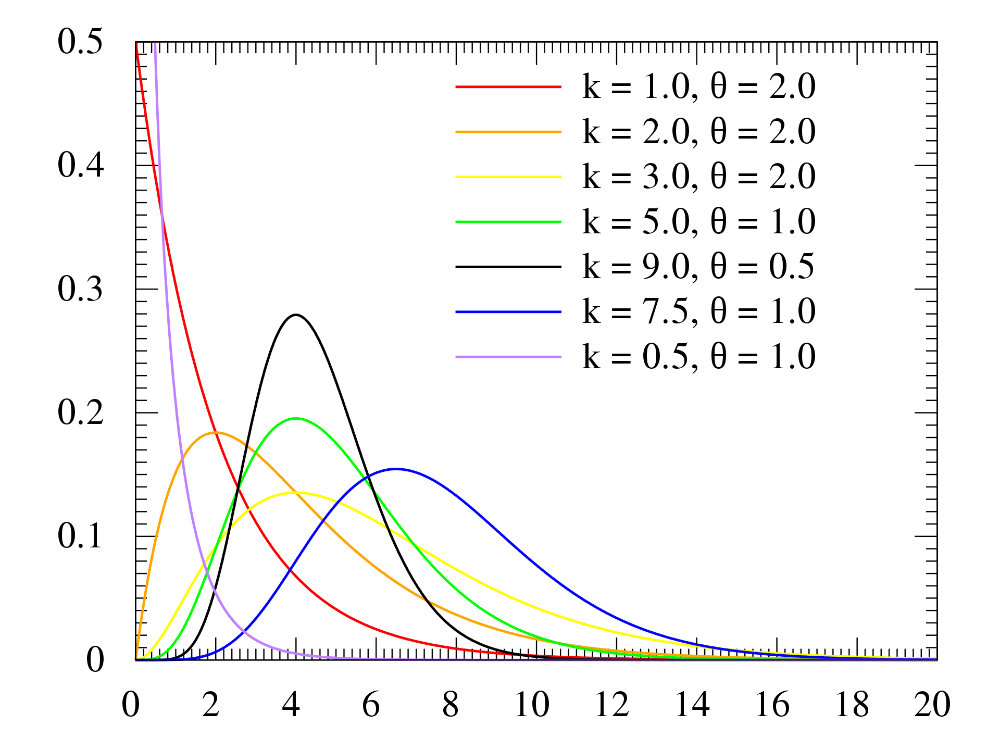

$$
\begin{align*}
c_i &\approx \mathcal{P}(\lambda) \\\\
\lambda &\approx \Gamma(k, s)
\end{align*}
$$

Very flexible and awesome to simulate sequencing reads. Hard to fit and thus
not awesome for regression.

---

## Things will escalate a bit now...

---

## Negative Binomial regression

$$
\begin{align*}
c_i &\approx \mathcal{NB}(\mu, \phi) \\\\
\log(\mu) &= \alpha + \boldsymbol{\beta}\mathbf{x}
\end{align*}
$$

We have $\mu = \mu$ and $\sigma^2 = \mu + \phi\cdot\mu^2$, so in general $\sigma^2 \geq \mu$.

The parameter $s$ thus can fit overdispersion.

---

## Beta-Binomial regression

Same idea but use the Binomial distribution with a beta distribution for the $p$ parameter.

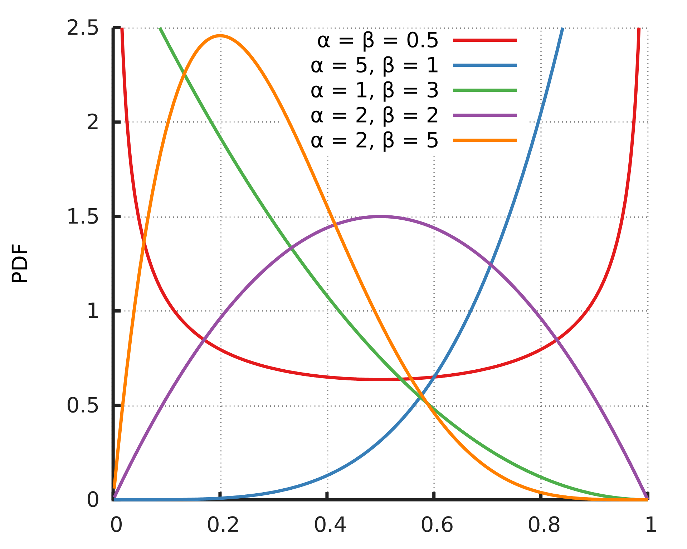

$$
\begin{align*}
c_i &\approx \mathcal{B}(n, p) \\\\
p &\approx \text{Beta}(m, \phi) \\\\
\log(\frac{m}{m-1}) &= \alpha + \boldsymbol{\beta}\mathbf{x}
\end{align*}
$$

We have $\mu = n\cdot m$ and $\sigma^2 = nm(1-m)\cdot(1 + (n-1)\phi)$, so also $\sigma^2 \geq \mu$.

Overdispersion is fitted by $\phi$.

---

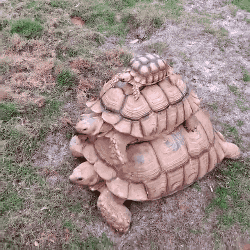

> Turtles all the way down. - Susan Holmes

If we would also put distributions on the regression parameters we would go fully Bayesian
but this requires MCMC methods to fit (for instance using STAN).

---

# What breaks the models?

- library size
- compositionality
- wrong quantity tested
- methodological bias
- p-value correction, FDR control choice

---

<!-- .slide: data-background="var(--primary)" class="dark" -->

## Summary

| Method              | Transformation | Overdispersion | estimated quantity | Language  | Packages             |
|---------------------|----------------|----------------|--------------------|-----------|----------------------|
| Rank methods        | ranks          | no             | ordering/rank sum  | Python, R | scipy                |
| Log-Normal          | log            | yes            | log-fold change    | Python, R | statsmodels, LIMMA, ANCOM-BC2 |
| Binomial            | logit          | no             | odds-ratio         | Python, R | statsmodels          |
| Poisson             | log            | no             | log-fold change    | Python, R | statsmodels          |
| Negative Binomial   | log            | yes            | log-fold change    | Python, R | statsmodels, VGAM, DESeq2, edgeR |
| Beta-Binomial       | logit          | yes            | odds ratio         | R         | corncob, VGAM        |

---

<!-- .slide: data-background="var(--primary)" class="dark" -->

  

### And we are done :clap:

# Thanks!